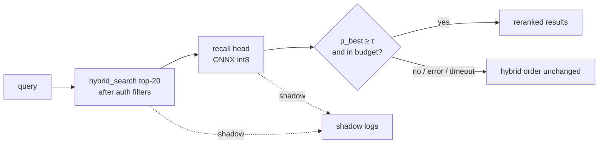

# ADR: Memory orchestrator small model

**Date:** 2026-09-23
**Status:** Accepted design (2026-09-24). P0 and P1 are approved. Later phases need a separate approval.
**Related:** issue #107 (Jev decision layer), `codex/jev-shadow` (seven-flow shadow), `docs/designs/embedder-upgrade.md` (LongMemEval baseline), `2026-03-27-extraction-model-fine-tuning.md` (parked generative fine-tune).

---

## Frame

### Source

> Hmm sure but ensure you dont crash my mac- btw - i was hoping for an even smaller model like a 100M or bellow - you should also explore functiongemma?

Brief (summarized from dk): a small model that holds the **skill** of memory (learn, recall, correlate, ignore) and none of the facts. Facts stay in the store. The store choice is deferred.

### Problem

- Memory decisions use a general LLM (Haiku) or an external API (Jev). Both are outside the process and both cost a network call per decision.
- The Sep 20 Jev shadow review found:
  - 52.0% action+target agreement with Haiku on AUDN (Add, Update, Delete, Noop, Conflict).
  - 22.8% invalid action/target combinations. Action and target were separate questions.
  - Link direction was conflated with link existence.
- The May 2026 memex fine-tune (Qwen3.5-2B, generative) scored AUDN 0.183 on production data and predicted NOOP 89% of the time. The causes were class imbalance and an eval/production mismatch.
- No reranker exists in the search path today. Search is BM25 + vector RRF (reciprocal rank fusion), plus graph and recency signals (`memory_engine.py:2902`).

### Outcome

- One small local model family (100M parameters or fewer) makes bounded memory decisions over supplied options, with calibrated confidence.
- If the model is confident, it decides. If not, the current path decides.
- The first skill (Recall) ships only if it beats current hybrid ranking on held-out data. If it does not, the work stops.

---

## Requirements (R)

| ID | Requirement | Status |
|----|-------------|--------|
| R0 | The model holds memory skills (recall, correlate, learn, ignore) and no facts. Facts come from the store at decision time. | Core goal |
| R1 | Each deployed model has 100M parameters or fewer. | Must-have |
| R2 | Each decision is one choice over a supplied option set. The model cannot return an ID outside the set or an invalid action/target combination. | Must-have |
| R3 | Each decision has a calibrated probability, so a threshold can route it to the local model or to the current path. | Must-have |
| R4 | The Recall skill beats current hybrid ranking on held-out gold labels and does not regress LongMemEval. If not, the project stops. | Must-have |
| R5 | The model runs on CPU inside the existing Memories container within a fixed latency and RSS (resident memory) budget. Any failure returns current behavior. | Must-have |
| R6 | Model output cannot widen source or tenant scope and cannot authorize a destructive action alone. Deterministic guards stay the authority. | Must-have |
| R7 | Each skill trains and evaluates from about 200 gold labels plus silver labels, with class balance. | Must-have |
| R8 | The license permits self-hosting and redistribution of fine-tuned weights. | Leaning must-have |

---

## Shapes

### CURRENT: Hybrid ranking + Haiku AUDN + Jev shadow

| Part | Mechanism |
|------|-----------|
| CUR1 | `hybrid_search`: BM25 + vector RRF (k=60), graph PPR support, optional recency (`memory_engine.py:2902`) |
| CUR2 | `query_intent.py`: regex temporal intent and date ranges |
| CUR3 | Haiku AUDN in `llm_extract.py` with engine guards |
| CUR4 | Jev shadow on seven flows: independent choice questions per flow (`jev_shadow.py`, branch `codex/jev-shadow`) |
| CUR5 | `search_feedback` table: `(memory_id, query, signal, search_id)` with `useful` / `not_useful` |

### A: Ettin encoder, one body, one head per skill

| Part | Mechanism | Flag |
|------|-----------|:----:|
| **A1** | **Base model** | |
| A1.1 | `ettin-reranker-32m-v1` default; `-68m-v1` as an arm; 17M as a floor. Cross-encoder, 8k context. Published MTEB retrieval NDCG@10: 17M 0.5576, 32M 0.5779, 68M 0.5915 (Qwen3-Reranker-0.6B 0.5940). Figures from the brief; verify on the model cards before use. | |
| A1.2 | Export to ONNX int8. Run with ONNX Runtime, which the container already uses for `onnx_embedder.py`. | |
| **A2** | **Recall head** (first skill) | |
| A2.1 | Score each `(query, candidate)` pair from the top N of CUR1 (N=20, same cap as the Jev retrieval flow). | |
| A2.2 | Softmax over candidate scores plus a learned `none` score. Output: reordered list and `P(best)`. | |
| A2.3 | Query intent head: 5-way classifier on the query alone (`lookup`, `temporal`, `comparison`, `relationship`, `unclear`, the Jev taxonomy). In scope with the Recall head. First consumer: `temporal` sets `include_archived`. | |
| **A3** | **Learn head** (AUDN) | |
| A3.1 | Score each `(new_fact, candidate)` pair into one relation: `unrelated`, `covered` (NOOP), `supersedes` (UPDATE), `revokes` (DELETE), `contradicts` (CONFLICT). | |
| A3.2 | Joint option set = `ADD` ∪ `{relation, candidate}` pairs. Choose the argmax over the joint set. Action and target come from one choice, so an invalid combination cannot occur. | |
| A3.3 | UPDATE replacement text stays with the LLM. The head selects; it does not generate. | |
| **A4** | **Correlate head** (links) | |
| A4.1 | Score the ordered pair `(a → b)` and the reverse pair `(b → a)` separately over link types plus `none`. | |
| A4.2 | Existence = `1 − P(none)`. Direction = the ordered pair with the higher type score. Existence and direction are separate outputs. | |
| **A5** | **Ignore head** (extraction filter, prune triage) | |
| A5.1 | Classify `(evidence, fact)` as `durable`, `ephemeral`, `unsupported`, `insufficient_evidence`. Advisory only. Never deletes. | |
| **A6** | **Cascade** | |
| A6.1 | Temperature scaling per head, fit on the dev split only. | |
| A6.2 | If `P(choice) ≥ τ_skill`, the local choice applies. Else the current path decides (hybrid order for Recall; Haiku for Learn). | |
| A6.3 | UPDATE, DELETE, and CONFLICT always go to the current path in v1, whatever the confidence. | |
| **A7** | **Body sharing** | |
| A7-A | Separate fine-tune per skill on the same base. About 35 MB per int8 copy (estimate). | |
| A7-B | One shared body, multi-task heads. | ⚠️ |

A7-B is flagged: multi-task interference on a 32M body is unmeasured. Start with A7-A. Merge to A7-B only if the merged model matches each separate head on its own held-out set.

### B: FunctionGemma-270M, one function call per decision

| Part | Mechanism | Flag |
|------|-----------|:----:|
| B1 | `google/functiongemma-270m-it`, Gemma license, 32k context. Needs a fine-tune. | |
| B2 | AUDN as one call: `audn(action, target_id)`. Constrained decoding with a grammar that lists only supplied IDs and valid pairs. | |
| B3 | Confidence from the sequence log-probability of the call. | ⚠️ |
| B4 | Runtime on CPU in the container. ONNX export or llama.cpp; latency per call unmeasured. | ⚠️ |
| B5 | Recall is out of scope for B. A generative call per candidate list is slower than a cross-encoder and gives no per-candidate score. | |

B is a comparison arm for Learn only. It exceeds R1.

---

## Fit Check

| Req | Requirement | Status | CURRENT | A | B |
|-----|-------------|--------|:-------:|:-:|:-:|
| R0 | The model holds memory skills (recall, correlate, learn, ignore) and no facts. Facts come from the store at decision time. | Core goal | ❌ | ✅ | ✅ |
| R1 | Each deployed model has 100M parameters or fewer. | Must-have | ❌ | ✅ | ❌ |
| R2 | Each decision is one choice over a supplied option set. The model cannot return an ID outside the set or an invalid action/target combination. | Must-have | ❌ | ✅ | ✅ |
| R3 | Each decision has a calibrated probability, so a threshold can route it to the local model or to the current path. | Must-have | ❌ | ✅ | ❌ |
| R4 | The Recall skill beats current hybrid ranking on held-out gold labels and does not regress LongMemEval. If not, the project stops. | Must-have | ❌ | ❌ | ❌ |
| R5 | The model runs on CPU inside the existing Memories container within a fixed latency and RSS budget. Any failure returns current behavior. | Must-have | ✅ | ✅ | ❌ |
| R6 | Model output cannot widen source or tenant scope and cannot authorize a destructive action alone. Deterministic guards stay the authority. | Must-have | ✅ | ✅ | ✅ |
| R7 | Each skill trains and evaluates from about 200 gold labels plus silver labels, with class balance. | Must-have | ❌ | ✅ | ❌ |
| R8 | The license permits self-hosting and redistribution of fine-tuned weights. | Leaning must-have | ✅ | ✅ | ❌ |

**Notes:**
- CURRENT fails R0, R1, R3, R7: no local model exists. Haiku is a general LLM. Jev asks action and target as separate questions (R2).
- R4 fails for every shape because nothing is measured yet. Phase P0 decides R4 for A.
- B fails R1: 270M parameters. B fails R3 and R5: B3 and B4 are flagged unknowns. B fails R7: a 270M generative model needs more than 200 gold labels plus silver labels to learn a new output format; memex is the precedent. B fails R8: Gemma terms add use restrictions.

**Selected shape: A** (A1 + A2 + A3 + A4 + A5 + A6 + A7-A). B stays as a Learn-only arm in P5.

---

## Detail A: Affordances and wiring

No UI changes. Non-UI affordances:

| ID | Affordance | Place | Wires out |
|----|------------|-------|-----------|
| N1 | `hybrid_search()` top-N candidates after authorization filters | `memory_engine.py` | → N2 |
| N2 | `recall_head.rank(query, candidates) → (order, p_best, p_none)` | new module, in-process ONNX | → N3 |
| N3 | Cascade gate: `p_best ≥ τ_recall` and no timeout → use N2 order; else N1 order | search route | → response |
| N4 | Shadow observer: log N1 order, N2 order, probabilities, latency | `shadow_runner.py` (reuse the Jev flow hook, new provider name) | → shadow logs |
| N5 | `learn_head.choose(fact, candidates) → (action, target, p)` | same module | → N6 |
| N6 | AUDN gate: ADD/NOOP with `p ≥ τ_learn` → local; else Haiku path | `llm_extract.py` | → engine guards |
| N7 | Label export: shadow logs + `search_feedback` → private JSONL for labeling | script, read-only | → gold/silver sets |

The recall head only reorders candidates that already passed authorization. It cannot add a candidate or read another scope (R6).

---

## Data

| Source | Use | Boundary |
|--------|-----|----------|
| Retrieval shadow logs (`query`, authorized candidates, hybrid order, Jev relevance) | Candidate pool for gold labeling | Private. Stay on the data volume. Read-only. |
| `search_feedback` (`useful` / `not_useful`) | Silver positives and negatives for Recall | Private. Sparse; one label per memory, not a full ranking. |
| Jev/Haiku agreement cases | Silver labels for Learn only | Agreement is not correctness (52.0% agreement). Never use as gold. |
| Issue #107 scenario families (12) | Fictional gold cases, split by family | Safe to commit. |
| `eval/generate_synthetic_memories.py` | Synthetic silver data | Distribution mismatch risk (memex precedent). |

Rules:

1. Label about 200 gold cases per skill. Split by scenario family, not by case, so paraphrases do not cross the split. Proposed split: 60 dev, 140 held-out.
2. Balance classes in training by sampling. Report per-class recall and a confusion matrix. Do not report accuracy alone. Memex failed on a 89% NOOP prior.
3. Do not train on LongMemEval. It is the regression set.
4. With 140 held-out cases, a 95% confidence interval on a proportion is about ±0.08. The gold set detects only large effects. Report paired bootstrap intervals.

---

## Evaluation and stop rule (Recall)

The baseline has little headroom on recall@5. The Jun 10 LongMemEval tool-mode run gave `recall_any_at_5` = 0.958 for MiniLM (n=120). A reranker reorders the top N. It cannot fix a candidate that hybrid search did not return.

Measure three things separately:

| Metric | What it isolates | Source |
|--------|------------------|--------|
| Candidate recall@20 of hybrid search | Ceiling for any reranker | gold set, LongMemEval |
| NDCG@5, MRR, recall@1 | Ranking quality inside the top 20 | gold set, LongMemEval tool mode |
| LongMemEval judge score and per-category recall@5 | End-to-end regression | `eval/run_longmemeval.py --mode tool` |

Stop rule (confirmed by dk, 2026-09-24):

- **Proceed** if held-out gold NDCG@5 improves by ≥ 0.03 over hybrid with the paired bootstrap 95% interval above 0, **and** no LongMemEval category drops by more than 0.05 recall@5.
- **Stop** if the fine-tuned 68M head does not meet the proceed rule. Do not scale up past 100M to rescue the result.

The +0.03 value matches the embedder-upgrade gate.

---

## Failure boundaries

| Location | Risk | Defense | Recovery |
|----------|------|---------|----------|
| N2 in the search route | Added latency or a crash on the hot path | Hard timeout (proposed 50 ms at p95 for 20 candidates, to measure). Exception or timeout returns the N1 order. | Env flag off; no restart of data services. |
| Container RSS | The model adds memory. The embedder auto-reload fires at 1.2 GB RSS (`EMBEDDER_AUTO_RELOAD_RSS_KB_THRESHOLD`). | Measure RSS delta in the eval stack before any production use. Load the model once, lazily. | Flag off. |
| N6 AUDN gate | A wrong local NOOP drops a fact. A wrong UPDATE/DELETE loses data. | v1 allows local ADD/NOOP only. UPDATE, DELETE, CONFLICT always go to Haiku. Engine guards stay. | Flag off. Audit log shows which path decided. |
| Calibration drift | The corpus changes and `τ` no longer matches the error rate. | Shadow logs keep local and current decisions side by side. Recompute coverage and error on a fresh sample each release. | Raise `τ` or turn the flag off. |
| Private data in weights | A model trained on private memories can memorize text, which conflicts with R0. | Prefer fictional and synthetic training data. Use private data for evaluation. Keep all weights private if private data is used. | Delete the weights; retrain on non-private data. |

The cascade does not call Haiku from the search route. A low-confidence Recall decision keeps the hybrid order. Escalation to an LLM happens only in flows that already call one (AUDN).

---

## Phases (slices)

| Phase | Work | Needs dk approval because |
|-------|------|---------------------------|
| P0 | Zero-shot `ettin-reranker-32m-v1` vs hybrid, offline replay on the gold set and LongMemEval tool mode. No training. | Approved 2026-09-24. Downloads weights (about 130 MB) and runs a short CPU job on the Mac with `nice`. |
| P1 | Label 200 Recall gold cases from shadow logs and #107 families. | Approved 2026-09-24. Reads private shadow logs read-only; labels stay on the data volume. |
| P2 | Fine-tune the Recall head (32M, then 68M) if P0 is close but short. | Training job. |
| P3 | Recall in shadow (N4) for one week. | Production deploy. |
| P4 | Recall behind an opt-in flag, default off. | Production behavior change. |
| P5 | Learn head (A3) vs FunctionGemma arm (B) on Learn gold. | Training jobs; B needs a larger fine-tune. |
| P6 | Correlate head (A4). | Training job. |
| P7 | Ignore head (A5), advisory only. | Training job. |

If P0 or P2 fails the stop rule, P3–P7 do not start.

---

## Decisions (dk, 2026-09-24)

| # | Question | Decision |
|---|----------|----------|
| D1 | Stop rule thresholds | NDCG@5 gain ≥ 0.03 on held-out gold with the paired bootstrap 95% interval above 0; no LongMemEval category drops more than 0.05 recall@5. |
| D2 | P0 on the Mac | Approved: download about 130 MB of weights and run a short CPU job with `nice`. |
| D3 | Shadow log access | Approved: read-only access to label about 200 Recall cases. Labels stay on the data volume. |
| D4 | Training data | Train on fictional and synthetic data. Use private data for evaluation only. |
| D5 | Body sharing | A7-A: one fine-tuned copy per skill. Merge to A7-B only if the merged model matches each separate head. |
| D6 | Query intent head | In scope with the Recall head (A2.3). |

## Out of scope

- The fact store choice.
- Generation of fact text, UPDATE replacement text, or merged text. The LLM keeps those.
- Replacing the embedder (see `docs/designs/embedder-upgrade.md`).
- Any training, benchmark, or model download in this design phase.
