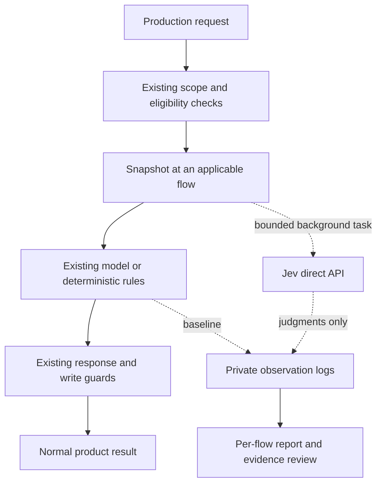

# Jev production shadow experiment

Jev observes seven production flows. Existing models and deterministic rules remain
responsible for responses and writes. The experiment measures potential product
improvements; agreement and lower latency alone do not establish better quality.

| Flow | Jev experiment | Existing authority |
| --- | --- | --- |
| Extraction | Check evidence support, attribution, durability, and category; review ADD/NOOP in single-call mode | Haiku generates facts |
| Memory actions (AUDN) | Choose ADD, UPDATE, DELETE, NOOP, or CONFLICT and an eligible target | Primary model plus engine guards |
| Relationships | Review proposed link type and direction | Existing auto-link rules |
| Retrieval | Judge authorized candidates for relevance and temporal fit; select a best candidate and query intent | Existing search ranking |
| Consolidation | Check compatibility before generation and information preservation after generation | Existing model and maintenance guards |
| Pruning | Distinguish explicit obsolescence, continued usefulness, and insufficient evidence | Existing eligibility rules |
| Promotion and sharing | Review support, shareability, and approve/reject/defer | Existing reviewer and permission guards |

The adapter uses the [direct TypeSafe API](https://docs.typesafe.ai/api), with
`jev-latest`. Logs record the returned model because the alias can change. No Gateway
or extra Haiku call is involved. Primary answers stay local, except generated facts
or proposed merge text deliberately supplied as evidence for a subsequent check.
Extraction category and action labels are removed from Jev's evidence inputs.



AUDN, consolidation compatibility, and promotion start Jev before waiting for the
primary model. Separate primary and shadow events share a call ID. A primary model
failure does not prevent the independent Jev request. Extraction and merge-preservation
checks require generated text, so they run afterward. Retrieval and rule-based flows
operate independently of Haiku. Hooks run only when their existing flow runs.

## Enable and stop

The global default is off. Set the direct credential in the service's private environment:

```dotenv
SHADOW_PROVIDERS=jev:jev-latest
TYPESAFE_API_KEY=<private credential>
JEV_SHADOW_FLOWS=all
SHADOW_LOG_DIR=/data/shadow-logs
```

`JEV_SHADOW_FLOWS` accepts `all` (default) or a comma-separated subset:
`extraction,audn,relationships,retrieval,consolidation,pruning,promotion`.
An empty selection disables these new hooks. Keep the environment file mode `0600`.
Recreate only Memories to apply changes. Remove `jev:jev-latest` from
`SHADOW_PROVIDERS` to stop the experiment. There is no automatic primary promotion.

Do not enable consolidation, pruning, or sharing merely to generate observations.
Inactive optional flows must remain marked `not_observed`. Read-only replay can test
those adapters; keep replay records separate from natural production traffic.

## Failure and data boundaries

- Shadow work uses eight threads with at most 16 running or queued tasks. Saturation
  drops observations instead of waiting. Primary and shadow events can be dropped
  separately; the report exposes missing events.
- Calls have a five-second HTTP timeout, no retries, and a one-megabyte response cap.
  The timeout applies to network operations, not total elapsed time.
- Requests and snapshots are capped at 100 KB. Credential-shaped input is skipped
  before transmission and private prompt logging.
- Extraction reviews up to 30 facts, or 25 in single-call mode. AUDN accepts at most
  50 facts. Relationship, retrieval, and pruning reviews cap candidates at 20.
  Records include evaluated and total counts when candidate lists are capped.
- Retrieval snapshots contain only candidates remaining after authorization filters.
  Relationship and maintenance checks retain existing scope and protected-record guards.
- Logs contain private production evidence. Keep them on the production data volume.
  Do not attach raw logs to public issues or PRs.
- Logs rotate at 10 MiB with five backups per model and flow: about 60 MiB each,
  or 420 MiB for seven flows. Historical legacy AUDN files have a separate limit.
- Per-process queue-drop counts appear in subsequent records. Drops immediately before
  shutdown may appear only in service logs. Rotation can remove earlier observations.

## Review after observation

```sh
python3 scripts/jev_shadow_report.py --log-dir /data/shadow-logs --days 7
python3 scripts/jev_shadow_report.py --log-dir /data/shadow-logs --days 7 \
  --review-out /private/location/jev-review.jsonl
```

The report joins independent events and lists all seven flows, including unobserved
flows. It separates failures, missing events, evaluated counts, latency, returned models,
and AUDN action/target agreement. Choice counts are descriptive, not quality scores.
The private packet contains up to 20 successful observations per flow for evidence review.

Review each flow against its source evidence. For extraction, check support and useful
information retained. For actions and links, check the selected action, target, type,
and direction. For retrieval, judge usefulness and time context. For merges, check
preserved facts and conditions. For pruning, require explicit evidence of obsolescence;
age and non-use do not establish falsehood. For sharing, check support and audience scope.

Use at least a week of normal traffic as an initial window, then inspect actual coverage.
Include primary/Jev disagreements and agreements. Label ambiguous evidence explicitly.
Do not pool different flows into one accuracy score. Confidence calibration requires
independent reference labels. No quality conclusion or switch to Jev follows automatically.
